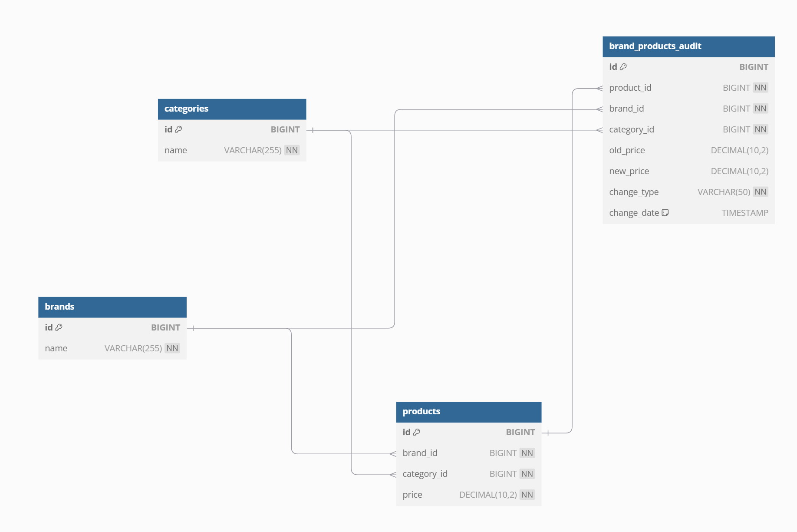

# [MUSINSA] Java(Kotlin) Backend Engineer - 과제

## 과제 수행 및 제출 방법

- 아래 과제 구현 조건을 확인 확인해 주시고, 그 외 자유롭게 작성합니다.
- "본 과제의 문제에는 답이 정해져 있지 않습니다. 따라서 문제를 스스로 해석하고 그 내용을 코드로 구현을 해주시길
  부탁드립니다. 과제를 평가하는 기준은 특정한 답을 확인하는 것이 아니라, 지원자 분께서 생각하신 대로 코드를 잘
  구현해(문제 해결) 주셨는지 확인해 보고자 합니다. 따라서, 문제에 대한 해석은 직접 해주시되, 필요한 경우 주석이나 노트를
  추가하여 저희에게 설명을 달아 주시기를 부탁드리겠습니다"
- 소스코드는 Github에 별도 프로젝트로 작성하고, 해당 프로젝트 링크를 결과로 제공 합니다. (Public 필수)
- Github 의 Readme 에는 아래 내용이 포함되어야 합니다.
    - 구현 범위에 대한 설명
    - 코드 빌드, 테스트, 실행 방법
    - 기타 추가 정보
    - 아래 기능은 포함하지 않아도 됩니다.
        - 로그 로깅
        - 모니터링
        - CI/CD
        - 인증 및 권한
    - DB를 구성이 필요하다면 로컬DB(H2)를 활용해 주세요.

| 기술스택        | 버전     |
|-------------|--------|
| spring boot | 3.3.4  |
| jdk         | 21     |
| gradle      | 8.10.2 |
| dbms        | H2     |

# 코드 빌드, 테스트, 실행 방법

- Build
    - ./gradlew clean build
- Test
    - ./gradlew test 또는 shop.test 실행
- Run
    - ./gradlew bootRun 또는 ProductApplication 실행

# Table 설명 및 ERD

## ERD

## Table 구성

1. brands 테이블:
    - 역할: 브랜드 정보를 저장하는 테이블.
    - 구조:
    - id: 브랜드의 고유 식별자(BIGINT), 자동 증가(AUTO_INCREMENT)하며, 기본 키(PRIMARY KEY)로 설정됩니다.
    - name: 브랜드 이름을 저장하는 필드(VARCHAR(255)), 이 필드는 비어 있을 수 없으며(NOT NULL), 브랜드의 고유한 이름을 저장합니다.
2. categories 테이블:
    - 역할: 카테고리 정보를 저장하는 테이블 (예: 상의, 하의, 신발 등).
    - 구조:
    - id: 카테고리의 고유 식별자(BIGINT), 자동 증가(AUTO_INCREMENT)하며, 기본 키(PRIMARY KEY)로 설정됩니다.
    - name: 카테고리 이름을 저장하는 필드(VARCHAR(255)), 이 필드도 비어 있을 수 없으며(NOT NULL), 제품이 속하는 카테고리의 이름을 저장합니다.
3. products 테이블:
    - 역할: 특정 브랜드의 카테고리별 상품 가격 정보를 저장하는 테이블입니다.
    - 구조:
    - id: 제품의 고유 식별자(BIGINT), 자동 증가(AUTO_INCREMENT)하며, 기본 키(PRIMARY KEY)로 설정됩니다.
    - brand_id: 해당 제품이 속한 브랜드의 ID를 가리키는 외래 키(FOREIGN KEY), brands 테이블의 **id**를 참조합니다.
    - category_id: 해당 제품이 속한 카테고리의 ID를 가리키는 외래 키(FOREIGN KEY), categories 테이블의 **id**를 참조합니다.
    - price: 해당 제품의 가격을 저장하는 필드(DECIMAL(10,2)), 가격은 소수점 이하 2자리까지 저장할 수 있습니다.
4. brand_products_audit 테이블:
    - 역할: 제품의 가격 또는 기타 정보 변경 내역을 저장하는 테이블 (로그 테이블).
    - 구조:
    - id: 로그의 고유 식별자(BIGINT), 자동 증가(AUTO_INCREMENT)하며, 기본 키(PRIMARY KEY)로 설정됩니다.
    - product_id: 변경된 제품이 속한 상품 ID를 저장합니다.
    - brand_id: 변경된 제품이 속한 브랜드의 ID를 가리키는 외래 키(FOREIGN KEY), brands 테이블의 **id**를 참조합니다.
    - category_id: 변경된 제품이 속한 카테고리의 ID를 가리키는 외래 키(FOREIGN KEY), categories 테이블의 **id**를 참조합니다.
    - old_price: 변경 전 가격을 저장하는 필드(DECIMAL(10,2)), 변경 전의 가격 정보를 기록합니다.
    - new_price: 변경 후 가격을 저장하는 필드(DECIMAL(10,2)), 변경 후의 가격 정보를 기록합니다.
    - change_type: 변경된 정보의 유형을 저장하는 필드(VARCHAR(50)), 예를 들어 가격 변경, 브랜드 변경, 카테고리 변경 등을 기록할 수 있습니다.
    - change_date: 변경된 날짜와 시간을 저장하는 필드(TIMESTAMP), 기본 값으로 현재 시점(CURRENT_TIMESTAMP)이 저장됩니다.

5. 외래 키 관계:

    - products 테이블의 **brand_id**는 brands 테이블의 **id**를 참조하며, **category_id**는 categories 테이블의 **id**를 참조합니다.
    - brand_products_audit 테이블은 변경된 제품의 정보를 추적하기 위해 **brand_id**와 **category_id**를 외래 키로 설정하며, 해당 값은 각각 **brands**와
      categories 테이블의 **id**를 참조합니다.

# 프로젝트 구성

- com.musinsa.shop
- ├── controller // API 요청을 처리하는 컨트롤러 클래스
- │ ├── ProductController.java
- │ └── BrandController.java
- ├── service // 비즈니스 로직을 처리하는 서비스 클래스
- │ ├── ProductService.java
- │ └── BrandService.java
- ├── repository // 데이터베이스와의 상호작용을 처리하는 리포지토리 클래스
- │ ├── ProductRepository.java
- │ ├── BrandRepository.java
- │ ├── CategoryRepository.java
- │ └── ProductRepository.java
- ├── entity
- │ ├── Product.java // 상품 엔티티
- │ ├── Brand.java // 브랜드 엔티티
- │ ├── Category.java // 카테고리 엔티티
- │ └── BrandProductsAudit.java // 이력 저장 엔티티
- ├── dto // DTO
- │ ├── ApiResponseDTO.java
- │ ├── BrandDTO.java
- │ ├── BrandPrice.java
- │ ├── CategoryDTO.java
- │ ├── CategoryPrice.java
- │ ├── CategoryPriceRangeDTO.java
- │ ├── CategoryPriceResponseDTO.java
- │ ├── ErrorResponseDTO.java
- │ ├── ProductDTO.java
- │ └── SingleBrandPriceResponseDTO.java
- ├── util // 공통 유틸리티 클래스들
- │ └── PriceFormatter.java
- │── exception // 익셉션 핸들러
- └── └── GlobalExceptionHandler.java

# 구현 범위에 대한 설명

## ProductController

# 요청 및 오류 처리

- 성공: 200 (OK) 또는 201 (CREATED) 상태 코드를 반환.
- 실패: 500 (INTERNAL SERVER ERROR) 상태 코드와 함께 오류 메시지를 포함한 ErrorResponseDTO 반환.

1. 카테고리 별 최저 가격 조회 API

- Endpoint: GET `/api/products/lowest-price`
- 기능: 모든 카테고리에서 가장 저렴한 제품의 브랜드와 가격을 조회합니다.
- 응답 예시:

* `{
  "categories": [
   {"category": "상의", "brand": "C", "price": "10,000"},
   {"category": "아우터", "brand": "E", "price": "5,000"},
   {"category": "바지", "brand": "D", "price": "3,000"},
   {"category": "스니커즈", "brand": "G", "price": "9,000"},
   {"category": "가방", "brand": "A", "price": "2,000"},
   {"category": "모자", "brand": "D", "price": "1,500"},
   {"category": "양말", "brand": "I", "price": "1,700"},
   {"category": "액세서리", "brand": "F", "price": "1,900"}
  ],
  "totalAmount": "34,100"
}`

- 오류 응답 예시:

* `{
"message": "오류가 발생 했습니다.",
"details": "오류 메시지 내용"
}`

2. 단일 브랜드 최저 가격 조회 API

- Endpoint: GET `/api/products/lowest-price-brand`
- 기능: 모든 카테고리에서 동일 브랜드의 최저 가격을 조회합니다.
- 응답 예시:

* `{
"brand": "D",
"categories": [
{"category": "상의", "price": "10,100"},
{"category": "아우터", "price": "5,100"},
{"category": "바지", "price": "3,000"},
{"category": "스니커즈", "price": "9,500"},
{"category": "가방", "price": "2,500"},
{"category": "모자", "price": "1,500"},
{"category": "양말", "price": "2,400"},
{"category": "액세서리", "price": "2,000"}
],
"totalAmount": "36,100"
}`

- 오류 응답 예시:

*` {
"message": "오류가 발생 했습니다.",
"details": "오류 메시지 내용"
}`

3. 카테고리 별 가격 범위 조회 API

- Endpoint: GET `/api/products/price-range-by-category`
- 기능: 특정 카테고리에서 최저 가격과 최고 가격의 브랜드와 금액을 조회합니다.
- 요청 파라미터:  category (String): 카테고리 이름.
- 응답 예시:

* `{
"category": "상의",
"minPrice": {"brand": "C", "price": "10,000"},
"maxPrice": {"brand": "I", "price": "11,400"}
}`

- 오류 응답 예시:

* `{
"message": "오류가 발생 했습니다.",
"details": "오류 메시지 내용"
}`

4. 상품 추가 API

- Endpoint: POST `/api/products/add`
- 기능: 새로운 상품을 추가합니다.
- 요청 바디:

* `{
"brand": {"id": 1},
"category": {"id": 2},
"price": 15000
}`

- 응답 예시:

* `{
"message": "상품 저장 성공",
"data": {
"id": 1,
"brand": {"id": 1, "name": "Brand A"},
"category": {"id": 2, "name": "Category A"},
"price": 15000
}
}`

- 오류 응답 예시:

* `{
"message": "상품 저장 실패",
"details": "오류 메시지 내용"
}`

5. 상품 업데이트 API

- Endpoint: PUT `/api/products/update/{id}`
- 기능: 기존 상품 정보를 업데이트합니다.
- 요청 파라미터:  id (Long): 상품 ID.
- 요청 바디:  (brand , category 미입력 시 가격만 업데이트)

*` {
"brand": {"id": 1},
"category": {"id": 2},
"price": 20000
}`

*` {
"price": 20000
}`

- 응답 예시:

* `{
"message": "상품 업데이트 성공",
"data": {
"id": 1,
"brand": {"id": 1, "name": "Brand A"},
"category": {"id": 2, "name": "Category A"},
"price": 20000
}
}`

- 오류 응답 예시:

*`{
"message": "상품 업데이트 실패",
"details": "오류 메시지 내용"
}`

6. 상품 삭제 API

- Endpoint: DELETE /api/products/delete/{id}
- 기능: 특정 ID를 가진 상품을 삭제합니다.
- 요청 파라미터:  id (Long): 상품 ID.
- 응답 예시:

* `{
"message": "상품 삭제 성공"
}`

- 오류 응답 예시:

* `{
"message": "상품 삭제 실패",
"details": "오류 메시지 내용"
}`

## BrandController

# 요청 및 오류 처리

- 성공: 200 (OK) 또는 201 (CREATED) 상태 코드를 반환.
- 실패: 500 (INTERNAL SERVER ERROR) 상태 코드와 함께 오류 메시지를 포함한 ErrorResponseDTO 반환.

1. 브랜드 추가 API

- Endpoint: POST `/api/brands/add`
- 기능: 새로운 브랜드를 추가합니다.
- 요청 바디:

* `{
  "name": "A"
  }`

- 응답 예시:

* `{
  "message": "브랜드 추가 성공",
  "data": {
  "id": 1,
  "name": "A"
  }
  }`

- 오류 응답 예시:

* `{
"message": "브랜드 저장 실패",
"details": "오류 메시지 내용"
}`

2. 브랜드 업데이트 API

- Endpoint: PUT `/api/brands/update/{id}`
- 기능: 특정 ID를 가진 브랜드의 정보를 업데이트합니다.
- 요청 파라미터: id (Long): 업데이트할 브랜드의 ID.
- 요청 바디:

* `{
  "name": "Brand B"
  }`

- 응답 예시:

* `{
  "message": "브랜드 변경 성공",
  "data": {
  "id": 1,
  "name": "Brand B"
  }
  }`

- 오류 응답 예시:

* `{
  "message": "브랜드 변경 실패",
  "details": "오류 메시지 내용"
  }`

3. 브랜드 삭제 API

- Endpoint: DELETE `/api/brands/delete/{id}`
- 기능: 특정 ID를 가진 브랜드를 삭제합니다.
- 요청 파라미터: id (Long): 삭제할 브랜드의 ID.
- 응답 예시:

* `{
  "message": "브랜드 삭제 성공"
  }`

- 오류 응답 예시:

* `{
  "message": "브랜드 삭제 실패",
  "details": "오류 메시지 내용"
  }`

## ProductService 클래스 구현 설명

1. 카테고리별 최저 가격 조회 API (getLowestPriceByCategory)
    - 설명: 모든 카테고리에서 최저가 상품을 조회하는 API.
    - 로직:
        - 상품 목록을 가져와 카테고리별로 그룹화 후 각 카테고리에서 가장 저렴한 상품을 선택.
        - 선택된 상품의 가격을 포맷팅하고, 각 카테고리별 상품 가격 총합을 계산.
    - 사용 기술:
        - Java 8 Stream API: 카테고리별 그룹화 및 최소값 계산에 사용.
        - Lombok: DTO와 엔티티 클래스에서 코드 간결성을 위해 사용.
        - Spring Boot: API 구축 및 서비스 계층을 통해 비즈니스 로직을 처리.
2. 단일 브랜드로 모든 카테고리 상품 조회 API (getLowestPriceForSingleBrand)
    - 설명: 단일 브랜드의 모든 카테고리에서 최저가 상품을 조회하고, 총액을 반환하는 API.
    - 로직:
        - 브랜드별로 상품을 그룹화한 후, 각 브랜드가 제공하는 카테고리별 최저가 상품을 선택.
        - 각 브랜드의 총 가격을 계산하고, 최저가 브랜드를 선택.
    - 사용 기술:
        - Java 8 Stream API: 브랜드별로 그룹화하고 최소값을 찾는 데 사용.
        - Spring Boot: RESTful API 구축 및 응답 생성.
3. 카테고리별 가격 범위 조회 API (getPriceRangeByCategory)
    - 설명: 특정 카테고리에서 최저가와 최고가 상품을 조회하는 API.
    - 로직:
        - 특정 카테고리의 모든 상품을 필터링하고, 최저가와 최고가 상품을 각각 찾음.
    - 사용 기술:
        - Java 8 Stream API: 필터링과 최저/최고 가격 계산에 사용.
        - Spring Boot: RESTful API로 구성하여 클라이언트에 응답을 전송.
4. 상품 추가 API (addProduct)
    - 설명: 새로운 상품을 추가하는 API.
    - 로직:
        - 브랜드와 카테고리 정보를 가져와서 상품을 추가한 후 성공적으로 저장된 상품에 대한 로그를 저장.
    - 사용 기술:
        - Spring Data JPA: 브랜드 및 카테고리 엔티티를 데이터베이스에서 조회하고 상품을 저장.
        - H2: 상품, 브랜드, 카테고리 데이터를 저장하기 위한 관계형 데이터베이스로 사용.
        - Lombok: 엔티티 및 DTO 클래스에서 Getter/Setter, 생성자 자동 생성을 위해 사용.
        - Hibernate: ORM을 통해 MySQL과 객체-관계 매핑 처리.
5. 상품 업데이트 API (updateProduct)
    - 설명: 기존 상품을 업데이트하는 API.
    - 로직:
        - 상품 ID로 기존 상품을 조회한 후 가격과 브랜드, 카테고리 정보를 업데이트.
        - 상품이 성공적으로 업데이트된 후, 변경 사항을 기록하는 로그를 저장.
    - 사용 기술:
        - Spring Data JPA: 상품 업데이트를 데이터베이스에 반영.
        - Transactional: 모든 작업이 성공적으로 처리되어야만 최종적으로 DB에 반영되도록 보장.
6. 상품 삭제 API (deleteProduct)
    - 설명: 특정 ID를 가진 상품을 삭제하는 API.
    - 로직:
        - 상품 ID로 해당 상품을 찾아서 삭제한 후, 삭제된 상품에 대한 로그를 기록.
    - 사용 기술:
        - Spring Data JPA: 상품을 데이터베이스에서 삭제.
        - Transactional: 트랜잭션을 통해 데이터 일관성을 보장.
7. 히스토리 저장 로직 (saveAuditLog)
    - 설명: 상품 추가, 수정, 삭제 시 해당 내역을 기록하는 메서드.
    - 로직:
        - 브랜드, 카테고리, 가격 정보와 변경된 작업(추가/수정/삭제)을 기록하여 brand_products_audit 테이블에 저장.
    - 사용 기술:
        - Spring Data JPA: 히스토리 데이터를 데이터베이스에 저장.
        - H2: 변경 사항을 기록하는 테이블(brand_products_audit)에 데이터를 저장.

## BrandService 클래스 구현 설명

1. 브랜드 추가 (addBrand)
    - 설명: 새로운 브랜드를 추가하는 메서드.
    - 로직:
        - BrandDTO로부터 브랜드 이름을 받아와 Brand 엔티티를 생성.
        - 생성된 브랜드 엔티티를 데이터베이스에 저장.
    - 사용 기술:
        - Spring Data JPA: 브랜드 정보를 데이터베이스에 저장.
        - Lombok: Brand 엔티티에 간결한 코드 작성을 위해 사용.
        - @Transactional: 트랜잭션 처리를 통해 데이터 일관성을 보장.
2. 브랜드 업데이트 (updateBrand)
    - 설명: 기존 브랜드 정보를 업데이트하는 메서드.
    - 로직:
        - 브랜드 ID를 이용해 데이터베이스에서 브랜드를 조회.
        - 브랜드가 존재하지 않으면 EntityNotFoundException 예외를 던짐.
        - 브랜드 이름을 BrandDTO로부터 가져와 기존 브랜드 정보를 업데이트한 후 데이터베이스에 저장.
    - 사용 기술:
        - Spring Data JPA: 브랜드 조회 및 업데이트 처리.
        - JPA의 EntityNotFoundException: 브랜드가 없을 때 예외 처리.
        - Lombok: 엔티티에서 getter/setter 자동 생성.
3. 브랜드 삭제 (deleteBrand)
    - 설명: 특정 브랜드를 삭제하는 메서드.
    - 로직:
        - 브랜드 ID로 브랜드를 조회하여 존재 여부를 확인.
        - 브랜드가 존재하지 않으면 EntityNotFoundException 예외를 던짐.
        - 조회된 브랜드를 삭제.
    - 사용 기술:
        - Spring Data JPA: 브랜드 삭제를 데이터베이스에 반영.
        - Lombok: 간결한 코드 작성을 위한 도구.

## 사용 기술 요약

1. Spring Boot

    - Spring Web: RESTful API 구축을 위해 사용.
    - Spring Data JPA: 데이터베이스 연동 및 CRUD 작업을 처리.
    - Spring Transactional: 트랜잭션 관리로 데이터 일관성 보장.
    - Java 8 Stream API
    - 데이터를 필터링하고, 그룹화하며, 최저/최고 가격을 계산하는 등의 작업에 사용.

2. H2

    - RDBMS로 사용하여 상품, 브랜드, 카테고리, 히스토리 데이터를 저장.
    - 관계형 데이터베이스 구조로 외래 키 제약조건 및 인덱스를 사용하여 성능 최적화.

3. Hibernate (JPA)

    - Java 객체와 H2 테이블 간의 매핑을 처리하는 ORM 기술.

엔티티가 존재하지 않을 경우 발생하는 예외를 사용하여 보다 구체적인 예외 처리 구현.

4. Lombok

    - @Getter, @Setter, @AllArgsConstructor 등의 애노테이션을 사용해 코드 간결성을 확보.

5. 예외 처리

    - IllegalArgumentException과 같은 구체적인 예외를 통해 잘못된 요청에 대한 명확한 에러 메시지를 제공.

6. 테스트 프레임워크

    - JUnit 5: 각 API와 서비스 로직에 대한 단위 테스트와 통합 테스트 작성.
    - Mockito: 의존성을 모킹(mocking)하여 유닛 테스트를 수행.

## 프로젝트 개선 포인트

- 로그 기능 강화: 로그 데이터가 필요한 경우 추적할 수 있도록 추가적인 필드나 기능 확장.
- 에러 메시지 처리: 클라이언트에게 보다 명확하고 구체적인 에러 메시지를 제공.
- 트랜잭션 관리 최적화: 트랜잭션 범위를 줄여 성능을 개선할 수 있는 부분을 확인하고 개선.
